# Task 1: Starting Fresh — Branching

Objective

Keep new feature development separate from the main branch so that unfinished work does not directly affect the stable codebase.

Solution

First, I cloned the repository and checked the available branches:

```bash
git clone [https://github.com/cloudnest/cloudnest-app.git](https://github.com/cloudnest/cloudnest-app.git)
cd cloudnest-app

git branch
git status

```

I made sure I was on the latest main branch:

```bash
git checkout main
git pull origin main
```

Then I created a separate feature branch:

```bash
git checkout -b feature/new-dashboard
```

I verified the branch:

```bash
git branch
```

Example output:

- feature/new-dashboard
main

I then made my changes and committed them to the feature branch:

```bash
git add .
git commit -m "Add server health dashboard"
```

Finally, I pushed the feature branch to GitHub:

```bash
git push -u origin feature/new-dashboard
```

Why I did this

The main branch should contain stable code, while feature branches allow developers to work independently. This prevents unfinished or experimental changes from directly affecting the main application.

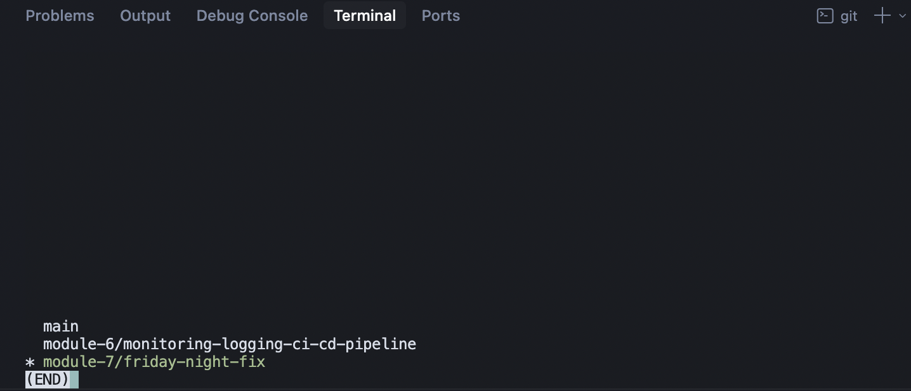

# Task 2: Interrupted Work — Git Stash

Objective

Rafi is working on a feature but has unfinished changes that are not ready to commit. An urgent bug needs to be fixed on another branch without losing the current work.

Solution

I started working on the dashboard feature:

```bash
git checkout feature/new-dashboard
```

I made some changes but they were not ready to commit.

I checked the working tree:

```bash
git status
```

Example:

Changes not staged for commit:
  modified: src/dashboard.js
  modified: src/styles.css

Because I didn't want to make an incomplete commit, I temporarily stored the changes using git stash:

```bash
git stash push -m "WIP: dashboard changes"
```

I confirmed that the working directory was clean:

```bash
git status
```

Then I switched to the bug-fix branch:

```bash
git checkout bug/fix-login
```

I fixed the urgent bug:

```bash
git add .
git commit -m "Fix login validation bug"
git push origin bug/fix-login
```

After the bug was fixed, I returned to my feature branch:

```bash
git checkout feature/new-dashboard
```

I checked the available stashes:

```bash
git stash list
```

Example:

stash@{0}: On feature/new-dashboard: WIP: dashboard changes

Then I restored my unfinished work:

git stash pop

I verified the changes:

```bash
git status
git diff
```

The unfinished dashboard changes were restored exactly as they were before switching branches.

Why I used git stash

git stash temporarily saves uncommitted changes without creating a commit. This is useful when urgent work requires switching branches but the current changes are not ready to be committed.

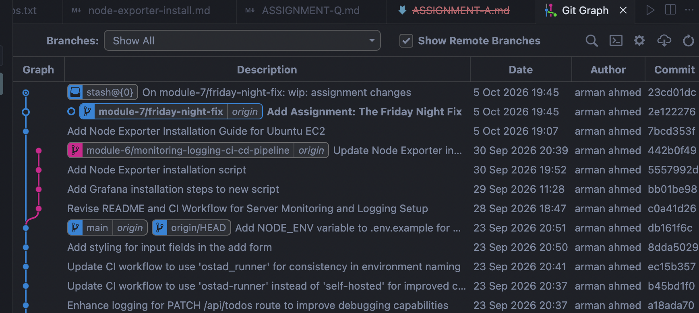

# Task 3: Cleaning the History — Rebase vs Merge

Objective

The feature branch is behind main. Nadia wants to see two ways of bringing the feature branch up to date:

Rebase — clean, linear history
Merge — preserve the complete branch history
Approach 1: Rebase

First, I made sure the feature branch contained my latest work:

```bash
git checkout feature/new-dashboard
git add .
git commit -m "Complete server dashboard"
```

I updated my local main:

```bash
git checkout main
git pull origin main
```

Then I switched back to the feature branch:

```bash
git checkout feature/new-dashboard
```

I rebased the feature branch onto the latest main:

```bash
git rebase main
```

If conflicts occurred, I would resolve them and continue:

```bash
git add .
git rebase --continue
```

After the rebase was completed, I checked the history:

```bash
git log --oneline --graph --all
```

The result is a clean, linear history.

Example:

- Feature commit
- Feature commit
- Main latest commit
- Main previous commit
- Initial commit

Because rebase rewrites commit history, if the branch had already been pushed, I would update the remote using:

```bash
git push --force-with-lease origin feature/new-dashboard
```

I would use `--force-with-lease` rather than plain `--force` because it provides an additional safety check.

Approach 2: Merge

For comparison, I created another feature branch from the same starting point:

```bash
git checkout -b feature/new-dashboard-merge
```

I updated main:

```bash
git checkout main
git pull origin main
```

Then I returned to the feature branch:

```bash
git checkout feature/new-dashboard-merge
```

I merged the latest main into it:

```bash
git merge main
```

If there were conflicts, I would resolve them and then run:

```bash
git add .
git commit
```

Finally, I checked the history:

```bash
git log --oneline --graph --all
```

The history now preserves the separate development paths and includes a merge commit.

Example:

- Merge branch 'main' into feature/new-dashboard-merge
|  
| * Main latest commit
| * Main previous commit
- | Feature commit
- | Feature commit
|/
- Initial commit


| Rebase                                 | Merge                                              |
| -------------------------------------- | -------------------------------------------------- |
| Creates a linear history               | Preserves branch history                           |
| Rewrites feature commits               | Does not rewrite existing commits                  |
| Easier to read with `git log`          | Shows when branches were combined                  |
| Can require force push                 | Normally no force push                             |
| Good for keeping feature history clean | Good when preserving complete history is important |


My choice

For a private feature branch, I would generally prefer rebase because it keeps the history clean and linear.

For a shared branch where rewriting history could affect other developers, I would prefer merge.

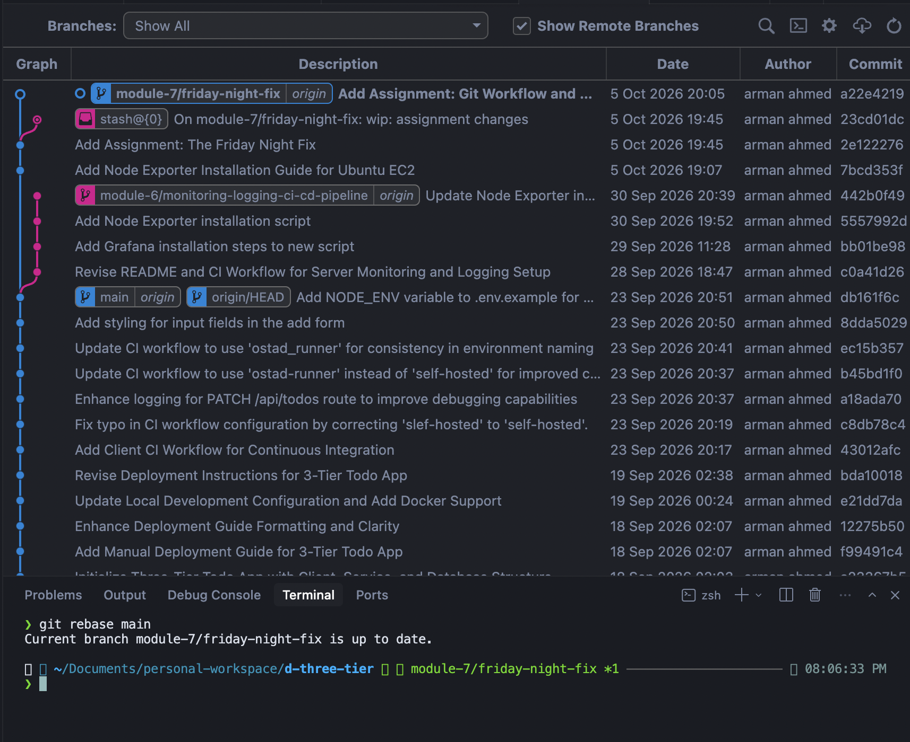

# Task 4: The Embarrassing Message — Correcting a Commit

Objective

A commit contains the message:

```bash
asdf fix
```

The message needs to be corrected before the history is shared.

Solution

I first checked the latest commit:

```bash
git log --oneline -5
```

Example:

```bash
a82f19c asdf fix
7d4b821 Add dashboard layout
3f8c122 Initial project setup
```

Since the incorrect message was the latest commit, I corrected it using:

```bash
git commit --amend -m "Fix dashboard data loading"
```

I verified the result:

```bash
git log --oneline -5
```

Now the history shows:

```bash
b31c9e2 Fix dashboard data loading
7d4b821 Add dashboard layout
3f8c122 Initial project setup
```

The commit content remains the same; only the commit metadata/message was changed.

If the commit had already been pushed

If the commit had already been pushed to a remote feature branch, I would need to update the remote history:

```bash
git push --force-with-lease origin feature/new-dashboard
```

I would avoid rewriting history on main or another shared branch.

Why I used `git commit --amend`

git commit --amend allows the most recent commit to be modified. In this case, it lets me replace the poor commit message with a meaningful description before the history is reviewed.

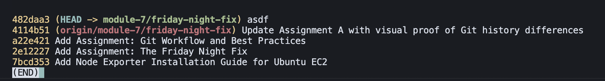
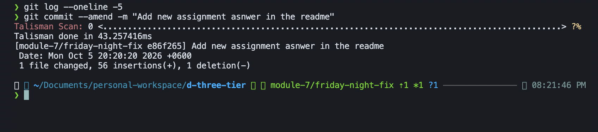
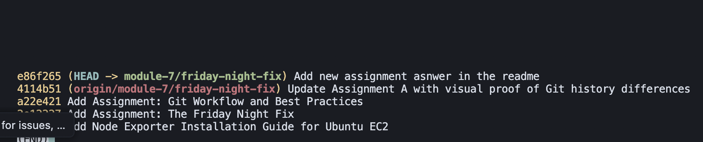

# Task 5: Our Own CI

For havving our own ci pipeline we are using an ec2 and use it as runner

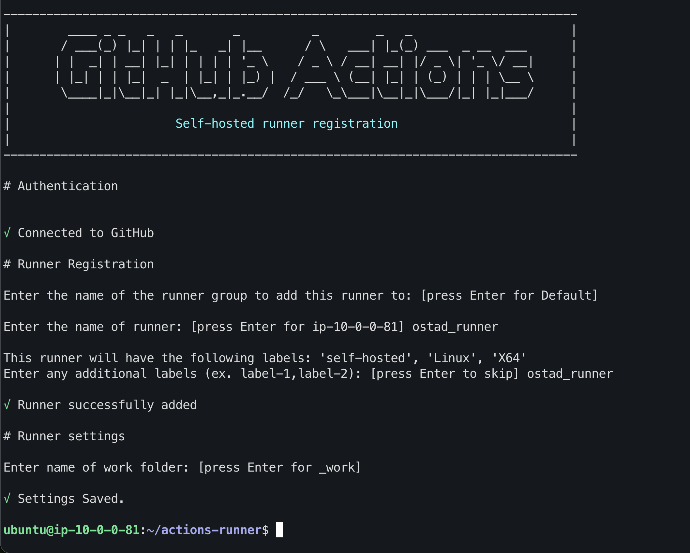
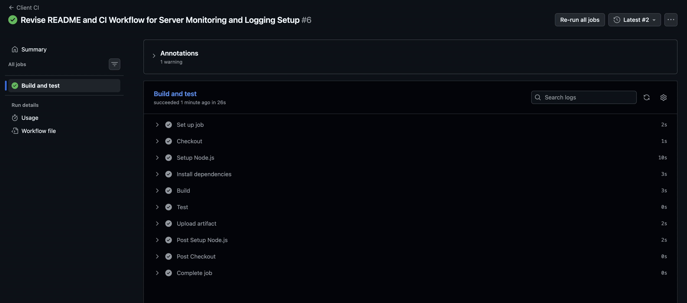

# Task 6: The Blind Server

Here we need full observability

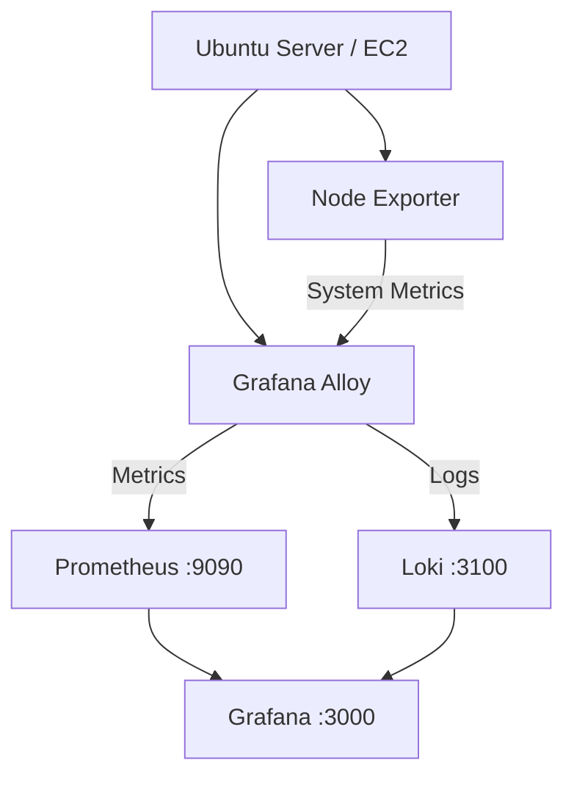


but here we won't install node exporter. as alow gives us opportunity to get the matrix

```bash
nano install-observability.sh
```

a single script file is given here [all install script](scripts/install-observability.sh)

```bash
chmod +x install-observability.sh
sudo bash ./install-observability.sh
```

#### verify

```bash
sudo systemctl status prometheus loki alloy grafana-server --no-pager
```

#### verify grafana locall

```bash
curl -I http://127.0.0.1:3000
```

#### If a service fails, inspect its logs individually

```bash
sudo journalctl -u grafana-server -n 50 --no-pager
sudo journalctl -u prometheus -n 50 --no-pager
sudo journalctl -u loki -n 50 --no-pager
sudo journalctl -u alloy -n 50 --no-pager
```

#### Open Grafana

Then in our browser, we may visit:

[http://EC2_PUBLIC_IP:3000](http://EC2_PUBLIC_IP:3000)

## Which ports should be open?


| Port  | Service    | Inbound Rule         |
| ----- | ---------- | -------------------- |
| 22    | SSH        | Your IP only         |
| 3000  | Grafana    | Your IP only         |
| 9090  | Prometheus | Do not open publicly |
| 3100  | Loki       | Do not open publicly |
| 12345 | Alloy UI   | Do not open publicly |


# Task 7: The Dashboard

#### what if pre defined dashboard used

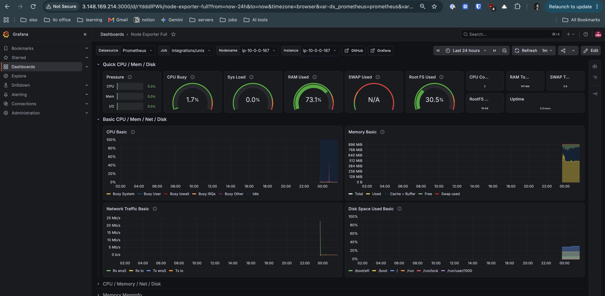

##### Import instructions

Open Dashboards in the left sidebar.

Click New → Import (the menu wording can vary by version).

Enter dashboard ID `1860`.

Click Load.

Under the Prometheus datasource selection, choose Prometheus.

Click Import.

#### what if design manually
##### Loki (for logs)
View my logs in Grafana

{job="system"}

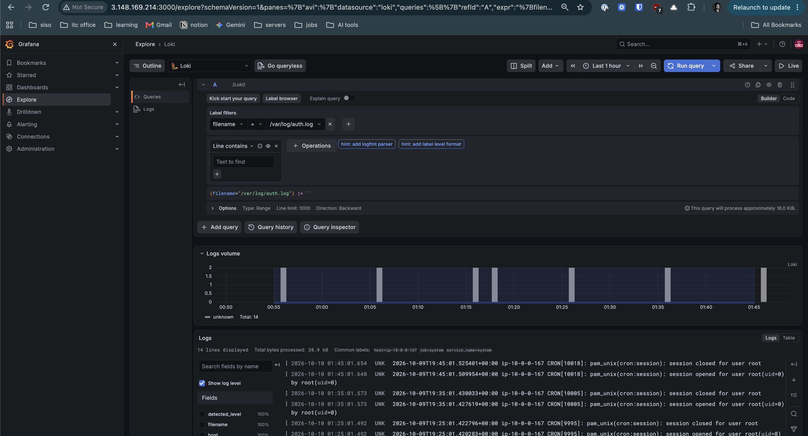

##### Prometheus (for system metrics)

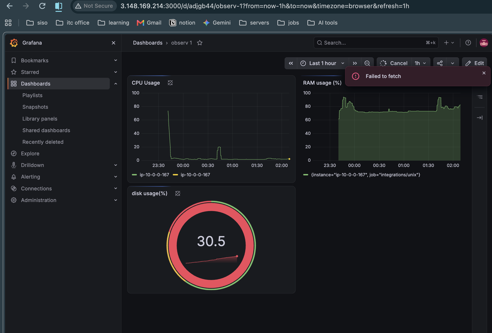

# Grafana EC2 Monitoring — Quick Cheat Sheet

A simple reference for my eight dashboard panels, their PromQL queries, and how to understand the results.

---

## 1. Metrics and queries

| Metric | PromQL query | Unit |
|---|---|---|
| CPU usage | `100 * (1 - avg(rate(node_cpu_seconds_total{mode="idle"}[5m])))` | % |
| RAM usage | `100 * (1 - node_memory_MemAvailable_bytes / node_memory_MemTotal_bytes)` | % |
| Disk usage | `100 * (1 - node_filesystem_avail_bytes{mountpoint="/",fstype!~"tmpfs\|overlay"} / node_filesystem_size_bytes{mountpoint="/",fstype!~"tmpfs\|overlay"})` | % |
| Incoming network | `rate(node_network_receive_bytes_total{device!~"lo\|veth.*\|docker.*"}[5m])` | Bytes/sec |
| Outgoing network | `rate(node_network_transmit_bytes_total{device!~"lo\|veth.*\|docker.*"}[5m])` | Bytes/sec |
| Uptime | `node_time_seconds - node_boot_time_seconds` | Seconds |
| System load (1 min) | `node_load1` | Load average |
| System load (5 min) | `node_load5` | Load average |
| System load (15 min) | `node_load15` | Load average |
| Disk used | `(node_filesystem_size_bytes{mountpoint="/"} - node_filesystem_avail_bytes{mountpoint="/"}) / 1024^3` | GB |
| Available RAM | `node_memory_MemAvailable_bytes / 1024^3` | GB |

> **Note:** The disk queries assume a single matching root filesystem. If your server has multiple matching series, filter by `device` to avoid duplicate results.

---

## 2. How to interpret the values

| Metric | Healthy starting point | Warning sign |
|---|---|---|
| CPU usage | Low to moderate | Consistently above 80% |
| RAM usage | Plenty of memory available | Consistently above 85–90% |
| Disk usage | Below 75% | Above 85%; critical near 95% |
| Network traffic | Depends on workload | Unexpected spikes or sustained saturation |
| Uptime | Depends on maintenance | Unexpected resets or frequent reboots |
| System load | Around or below CPU core count | Sustained load above core count |

These are general starting thresholds, not universal rules. For example, high CPU can be normal during a deployment.

---

## 3. Understand the PromQL functions

- **`rate(metric[5m])`** — calculates the average per-second increase of a counter over five minutes.
- **`avg(...)`** — averages values across matching series.
- **`100 * (...)`** — converts a fraction into a percentage.
- **`node_memory_MemAvailable_bytes`** — estimates memory available for new applications without swapping.
- **`node_boot_time_seconds`** — Unix timestamp when the system booted.
- **`node_load1`, `node_load5`, `node_load15`** — system load averages over 1, 5, and 15 minutes.

---

## 4. Remember the architecture

1. **Grafana Alloy**
   - Collects system metrics
2. **Prometheus**
   - Stores metrics and evaluates PromQL
3. **Grafana**
   - Displays dashboards and graphs

> **Troubleshooting tip:** If a panel displays *No data*, open Grafana Explore and test the metric name directly, such as `node_cpu_seconds_total`. Your Alloy exporter must expose the corresponding metric for the query to work.