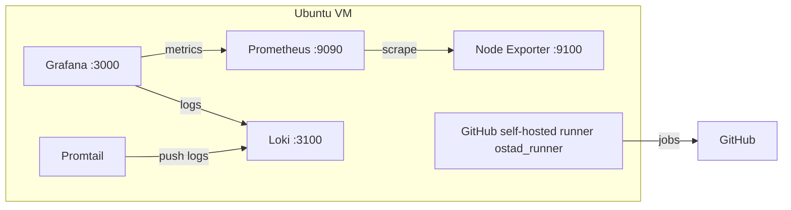

# DevOps Batch 14 — Server Monitoring, Logging & CI Pipeline

**Student Name:** Arman Ahmed  
**Batch:** DevOps Batch 14  
**Assignment Title:** Server Monitoring, Logging & CI Pipeline  
**GitHub Repository:** https://github.com/Arman-Ahmed-Jony/d-three-tier

This repository contains a three-tier Todo app plus a **manual** Prometheus, Node Exporter, Grafana, and Loki stack (no Docker for those components) and a GitHub Actions CI pipeline on a **self-hosted runner**.

> Do **not** commit passwords, API keys, SSH private keys, Grafana credentials, or GitHub runner tokens.

## Project Overview

The goal is a basic DevOps environment on **one Ubuntu server**:

| Component | Role | Port |
|-----------|------|------|
| Node Exporter | System metrics (CPU, RAM, disk, network) | 9100 |
| Prometheus | Scrapes Node Exporter and stores metrics | 9090 |
| Grafana | Dashboards and log explore UI | 3000 |
| Loki | Log store | 3100 |
| Promtail | Ships systemd journal logs to Loki | 9080 |
| GitHub Actions runner | Self-hosted CI (`ostad_runner`) | — |

Prometheus, Node Exporter, Grafana, and Loki are installed from official binaries / `.deb` packages and run as **systemd** services. Docker / Docker Compose is **not** used for this stack.

Promtail is included because Loki does not collect logs by itself. Grafana Explore uses Loki with labels such as `{job="systemd-journal"}`.

## Architecture Diagram



Keep 9090 / 9100 / 3000 / 3100 off the public internet. Prefer SSH tunnels or UFW limited to your IP.

```bash
ssh -L 3000:127.0.0.1:3000 -L 9090:127.0.0.1:9090 -L 9100:127.0.0.1:9100 USER@VM_HOST
```

Then open http://127.0.0.1:3000, http://127.0.0.1:9090, and http://127.0.0.1:9100/metrics in a local browser.

## Installation Steps

Target: **Ubuntu 22.04 or 24.04**, run as root. Clone this repo on the VM first.

### Automated install (same manual binary + systemd steps)

```bash
sudo bash scripts/install-all.sh
sudo bash scripts/verify.sh
```

Install one component at a time if needed:

```bash
sudo bash scripts/install-node-exporter.sh
sudo bash scripts/install-prometheus.sh
sudo bash scripts/install-loki.sh
sudo bash scripts/install-promtail.sh
sudo bash scripts/install-grafana.sh
```

Pinned versions (override with env vars):

| Component | Version |
|-----------|---------|
| Node Exporter | 1.12.1 |
| Prometheus | 3.14.0 |
| Loki | 3.7.8 |
| Promtail | 3.4.2 (last zip release; Promtail was removed from Loki 3.7+) |
| Grafana OSS | 13.2.2 |

### Equivalent hand steps (what the scripts do)

1. Create system users (`node_exporter`, `prometheus`, `loki`, `promtail`).
2. Download official GitHub release tarballs / zips (Grafana: official OSS `.deb`).
3. Install binaries to `/usr/local/bin`.
4. Copy configs from `monitoring/` to `/etc/<service>/`.
5. Install systemd units, then `systemctl daemon-reload && systemctl enable --now <service>`.

**Grafana default login:** `admin` / `admin`. Change it on the server. Never put it in git.

### GitHub self-hosted runner (separate — needs a token)

1. GitHub → **Settings → Actions → Runners → New self-hosted runner**
2. Copy the registration token (do not commit it)

```bash
export RUNNER_TOKEN='...'
sudo -E bash scripts/install-github-runner.sh
```

The runner is installed under `/opt/actions-runner` with label `ostad_runner` and enabled as a systemd service.

### Verify

```bash
sudo bash scripts/verify.sh
```

Checks include `systemctl is-active`, Node Exporter `/metrics`, Prometheus `/-/ready` and **node target UP**, Loki `/ready`, Grafana `/api/health`.

Manual curls:

```bash
curl -s http://127.0.0.1:9100/metrics | head
curl -s http://127.0.0.1:9090/-/ready
curl -s http://127.0.0.1:9090/api/v1/targets
curl -s http://127.0.0.1:3100/ready
curl -s http://127.0.0.1:3000/api/health
```

## Configuration Details

| Path | Purpose |
|------|---------|
| [monitoring/prometheus/prometheus.yml](monitoring/prometheus/prometheus.yml) | Scrape `localhost:9090` (Prometheus) and `localhost:9100` (Node Exporter job `node`) |
| [monitoring/prometheus/prometheus.service](monitoring/prometheus/prometheus.service) | systemd unit |
| [monitoring/node-exporter/node_exporter.service](monitoring/node-exporter/node_exporter.service) | systemd unit, metrics on `:9100` |
| [monitoring/loki/loki-config.yml](monitoring/loki/loki-config.yml) | Single-process Loki, filesystem store under `/var/lib/loki` |
| [monitoring/loki/loki.service](monitoring/loki/loki.service) | systemd unit |
| [monitoring/promtail/promtail-config.yml](monitoring/promtail/promtail-config.yml) | Journal scrape, push to Loki |
| [monitoring/promtail/promtail.service](monitoring/promtail/promtail.service) | systemd unit (`systemd-journal` group) |
| [monitoring/grafana/datasources.yaml](monitoring/grafana/datasources.yaml) | Provision Prometheus + Loki datasources |
| [monitoring/grafana/dashboards.yaml](monitoring/grafana/dashboards.yaml) | File dashboard provider |
| [monitoring/grafana/node-overview.json](monitoring/grafana/node-overview.json) | CPU, memory, disk, network panels |
| [scripts/install-all.sh](scripts/install-all.sh) | Orchestrates the five install scripts |
| [scripts/verify.sh](scripts/verify.sh) | Health checks after install |
| [scripts/install-github-runner.sh](scripts/install-github-runner.sh) | Self-hosted runner (`RUNNER_TOKEN` only) |
| [.github/workflows/client.yml](.github/workflows/client.yml) | Client CI: Build → Test → Artifact |

Dashboard queries:

- **CPU:** `100 - (avg by (instance) (rate(node_cpu_seconds_total{mode="idle"}[5m])) * 100)`
- **Memory:** `(1 - (node_memory_MemAvailable_bytes / node_memory_MemTotal_bytes)) * 100`
- **Disk:** `(1 - (node_filesystem_avail_bytes{mountpoint="/"} / node_filesystem_size_bytes{mountpoint="/"})) * 100`
- **Network:** `rate(node_network_receive_bytes_total[5m])` and `rate(node_network_transmit_bytes_total[5m])`

Grafana Explore (Loki): `{job="systemd-journal"}`

## CI Pipeline Explanation

Workflow: [.github/workflows/client.yml](.github/workflows/client.yml)

- **Runner:** self-hosted, label `ostad_runner` (not GitHub-hosted)
- **Triggers:** push/PR that touch `client/` or the workflow file, plus **workflow_dispatch** (Actions → Run workflow)
- **Build:** `npm ci` then `npm run build` in `client/`
- **Test:** assert `dist/index.html` is non-empty, `dist/assets` exists, and the HTML contains `id="root"`
- **Artifact:** `actions/upload-artifact@v4` uploads `client/dist` as `todo-client-build`

Deployment / CD is **not** part of this assignment.

## Screenshots

Save proof images under [docs/screenshots/](docs/screenshots/) using the filenames below (see that folder’s README for capture notes).

### Prometheus


### Node Exporter


### Grafana


### Loki


### GitHub Actions


## Result / Conclusion

This project shows a complete basic DevOps loop on Ubuntu:

1. Host metrics via **Node Exporter**, scraped by **Prometheus**, visualized in **Grafana**.
2. Host logs via **Promtail → Loki**, queried in Grafana Explore.
3. Client **CI** on a **self-hosted runner**: build, test, and upload a GitHub Actions artifact.

All monitoring components are installed as systemd services from official packages — not Docker. Secrets stay on the server, not in this repository.

## Todo app (reference)

The app itself is unchanged: React + Vite client, Express + Mongoose service, MongoDB.

| Tier | Folder | Stack |
|------|--------|--------|
| Client | `client/` | React + Vite |
| Service | `service/` | Express + Mongoose |
| Database | — | MongoDB |

Local app development (not used for Prometheus/Grafana/Loki):

```bash
cd service && cp .env.example .env && npm install && npm run dev
cd client && npm install && npm run dev
```

Service: http://localhost:5001 — Client: http://localhost:5173  

For the previous **manual 3-tier AWS/VM deployment** assignment, see [DEPLOYMENT.md](./DEPLOYMENT.md).
